# Attention-First UIX — Complete Implementation Plan

## Epic Context

**Source:** [attention-first-uix-epic.json](01_EPIC/attention-first-uix-epic.json)

**Vision:** Incrementally evolve befly toward an attention-protecting, distraction-free UIX where protecting attention is the product. Writers need a thinking environment, not a content platform.

**Problem:** Current UI exposes all controls at once (metadata, cover, themes, visibility) and uses blocking modals, increasing cognitive load and interrupting flow.

**Definition of Done (Epic-level):**

- Cognitive load: ≤5 visible controls in Write default view
- Time to first keystroke: no regression, <100ms perceived
- Typography flow: non-blocking
- Empty states: "Start a thought"
- Navigation: single-level, ⌘K reachable
- Platform feels still, not busy

**Numbering convention:** `P{phase}-uix-{seq}` — phase drives build order; seq is sequential across phases.

---

## Build Order (18 ATOMICs)

| Order | ID        | Phase | Atomic                   | Short Description                                                                        |
|:-----:|-----------|-------|---------------------------|------------------------------------------------------------------------------------------|
| 1 | P1-uix-01 | P1 | Full-width editor layout | Expand editor to full viewport width; minimal chrome in default view. |
| 2 | P1-uix-02 | P1 | Slide-out metadata panel | Move metadata (cover, themes, visibility) into slide-out drawer; hide from default view. |
| 3 | P1-uix-03 | P1 | Non-blocking typography | Typography flow must not block writing; progressive reveal. |
| 4 | P2-uix-04 | P2 | Single accent colour | Reduce palette to one accent; remove visual noise. |
| 5 | P2-uix-05 | P2 | Breathing space | Add whitespace; reduce density for visual calm. |
| 6 | P2-uix-06 | P2 | Caret animation | Smooth, breathing caret to reduce harsh blink; aids focus. |
| 7 | P3-uix-07 | P3 | Word count on pause | Show word count only when user pauses typing. |
| 8 | P3-uix-08 | P3 | Milestone moments | Celebrate 500/1000-word milestones with subtle feedback. |
| 9 | P3-uix-09 | P3 | Haptic/Audio cues | Subtle paper sounds or haptics on milestones; reinforces Reflect mode. |
| 10 | P4-uix-10 | P4 | Performance baseline | Zero lag typing, code-splitting; input latency is the #1 focus killer. |
| 11 | P4-uix-11 | P4 | Annotation data schema | Establish annotation/fragment schema; design + hooks infra. |
| 12 | P5-uix-12 | P5 | Focus modes | Write / Edit / Reflect modes; toggle UI density per mode. |
| 13 | P6-uix-13 | P6 | Opinionated defaults | Simplified visibility; reduced decision fatigue. |
| 14 | P7-uix-14 | P7 | Command palette | Global ⌘K palette; Zen styling to match Phase 2; respects Focus Modes. |
| 15 | P8-uix-15 | P8 | Toast replacements | Replace blocking alert/confirm with non-blocking toasts. |
| 16 | P8-uix-16 | P8 | Focus-Lock | Toggle to disable Command Palette and Toasts for deep work. |
| 17 | P9-uix-17 | P9 | Last document return | Restore last edited document on app load. |
| 18 | P9-uix-18 | P9 | Empty state copy | Replace generic empty states with "Start a thought". |

---

## Phase Flow

```mermaid
flowchart LR
    subgraph P1 [Phase 1 Structural]
        P1_01[P1-uix-01 Full-width]
        P1_02[P1-uix-02 Slide-out]
        P1_03[P1-uix-03 Typography]
    end
    subgraph P2 [Phase 2 Sensory]
        P2_04[P2-uix-04 Accent]
        P2_05[P2-uix-05 Breathing]
        P2_06[P2-uix-06 Caret]
    end
    subgraph P3 [Phase 3 Engagement]
        P3_07[P3-uix-07 Word count]
        P3_08[P3-uix-08 Milestones]
        P3_09[P3-uix-09 Haptic]
    end
    subgraph P4 [Phase 4 Infra]
        P4_10[P4-uix-10 Perf]
        P4_11[P4-uix-11 Schema]
    end
    subgraph P5 [Phase 5 Modes]
        P5_12[P5-uix-12 Focus modes]
    end
    subgraph P6 [Phase 6 Defaults]
        P6_13[P6-uix-13 Defaults]
    end
    subgraph P7 [Phase 7 Nav]
        P7_14[P7-uix-14 Palette]
    end
    subgraph P8 [Phase 8 Feedback]
        P8_15[P8-uix-15 Toasts]
        P8_16[P8-uix-16 Focus-Lock]
    end
    subgraph P9 [Phase 9 Emotional]
        P9_17[P9-uix-17 Last doc]
        P9_18[P9-uix-18 Empty state]
    end
    P1 --> P2 --> P3 --> P4 --> P5 --> P6 --> P7 --> P8 --> P9
```

---

## Design Rationale

| Change | Rationale |
|--------|-----------|
| P4: Performance baseline (P4-uix-10) | Input latency is the #1 focus killer. If the UI looks calm but feels laggy, the Attention promise is broken. Moved from Phase 11. |
| P4: Annotation schema (P4-uix-11) | Ghost phases create momentum gaps. One infra ATOMIC per ghost phase keeps velocity. |
| P6: Opinionated defaults (P6-uix-13) | Same; fills ghost phase with concrete work. |
| P5/P7 swap | Focus Modes (P5) before Command Palette (P7). The palette must respect modes (e.g. less intrusive in Reflect); designing it after modes avoids rework. |
| P2: Caret animation (P2-uix-06) | Smooth caret reduces harsh blink; aids focus. |
| P3: Haptic/Audio (P3-uix-09) | Dopamine loops are core functional requirement, not polish. Reinforces Reflect mode. |
| P8: Focus-Lock (P8-uix-16) | Toggle to disable palette and toasts for deep work. |

---

## Phases Without Explicit ATOMICs (Epic Scope)

- **Phase 10:** Audit metric prominence
- **Phase 12:** Markdown toggle, split preview, version history (future)

---

## Out of Scope (Epic)

- Rich text editor (stay with textarea + Markdown)
- Full annotation/fragment backend (Phase 4 is design + hooks only)
- Dark mode
- Mobile-specific layouts beyond current responsive
